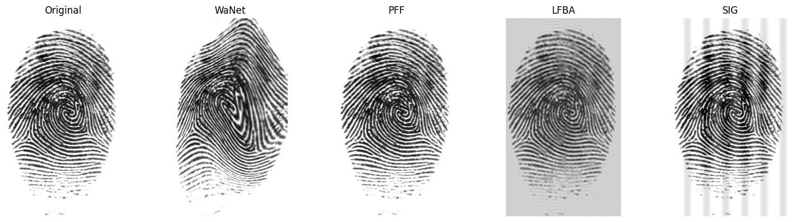

# From-RGB-to-Grayscale-Backdoor-Attacks-in-Fingerprint-Verification

This study presents the first systematic evaluation of backdoor attacks in fingerprint verification systems, exploring how methods designed for natural images and facial domains transfer to grayscale ridge–valley patterns.  

---

## Abstract  
Backdoor attacks have become a significant concern in deep learning, as they allow models to behave normally on clean inputs while misclassifying inputs stamped with hidden triggers. These attacks have been extensively studied in natural image domains such as CIFAR-10 and ImageNet, as well as in the facial domain including recognition and forgery detection. Despite this progress, the impact of backdoors on fingerprint verification has not been systematically investigated. Fingerprint systems are uniquely dependent on grayscale ridge–valley structures with limited texture diversity, raising new challenges for attack transferability. We evaluate four representative families: WaNet (geometric warping), Poisoned Forgery Face (PFF, trigger generator with convolving-based perturbations), sinusoidal signals (SIG), and low-frequency perturbations (LFBA). Results show WaNet fails due to ridge distortion, SIG and PFF obtain moderate success but reduce accuracy, while LFBA achieves the highest success yet introduces visible artifacts. These findings highlight fingerprint-specific constraints that limit the direct transfer of standard methods and motivate domain-specific attacks and defenses.  

---

## Dataset

For the fingerprint verification task, we used the **Fingerprint Verification Competition (FVC) datasets** — FVC2000, FVC2002, and FVC2004.  
Make sure the datasets are downloaded and placed appropriately before training or evaluation. The structure and path may need to be adjusted depending on your platform (Kaggle, Colab, or local machine).

Datasets used:  
- [FVC2000 Dataset](http://bias.csr.unibo.it/fvc2000/default.asp)  
- [FVC2002 Dataset](http://bias.csr.unibo.it/fvc2002/default.asp)  
- [FVC2004 Dataset](http://bias.csr.unibo.it/fvc2004/default.asp)

---
## Usage
Make sure to place the correct paths in the files wherever required and also for the generator in the PFF.
- `clean_training.py`: trains the Siamese CNN on fingerprints without backdoors.
- `Wanet_train_test.py`: trains and evaluates model with WaNet perturbations.
- `sig_train_test.py`: trains and evaluates model with SIG triggers.
- `pff_train_test.py`: trains and evaluates model with Poisoned Forgery Face (PFF, trigger generator with convolving-based perturbations) attack using the pretrained generator (`generator.pth`).
- `lfba_train_test.py`: trains and evaluates model with low frequency backdoor attack.

---
## Visual Examples

Below is a visual comparison of original and poisoned fingerprints across different backdoor attack methods.

